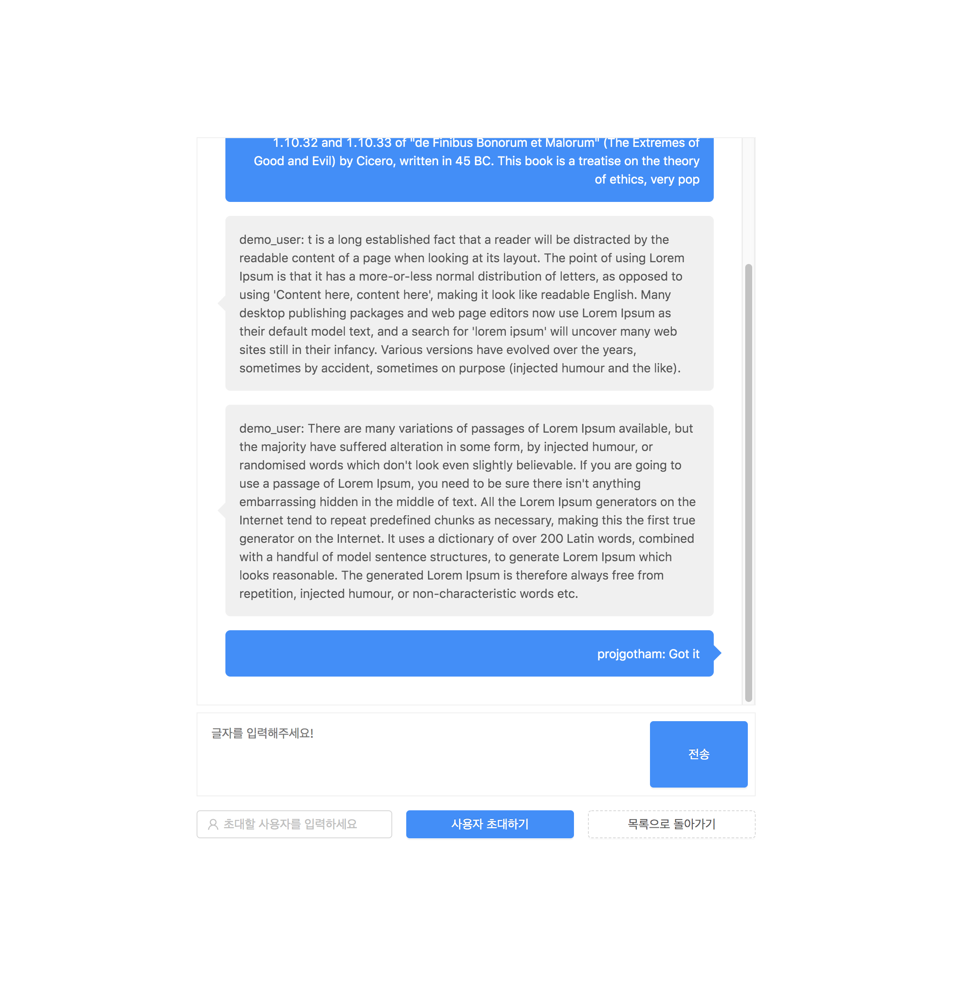

# Chat App



Chat App은 실시간 채팅 애플리케이션입니다.
프론트 ReactJS와 백엔드 NodeJS 기반으로, SocketIO를 사용하여 실시간으로 메시지를 상호간에 주고 받을 수 있습니다.

모든 내용은 브라우저 세션에만 남아있기 때문에, 브라우저 종료시에 데이터가 사라지게 됩니다.

## Getting Started
```
/** Front의 경우 */
cd ./frontend && npm install

npm run start

/** Backend의 경우 */
cd ./backend && npm install

node index.js

/** Front Testing */
cd ./frontend && npm run test
```
* Front는 Default로 3000번 포트를, Back은 Default로 8080 포트를 사용하고 있습니다.

## 세부기능
1. 사용자 초대:
사용자 초대를 진행할 수 있습니다. 채팅창 하단에 초대하고자 하는 사용자의 이름을 올린 뒤, '사용자 초대하기' 버튼을 누르면, 현재 접속되어 있는 사용자는 해당 채팅창으로 넘어오게 됩니다.

2. 채팅방 추가:
기본으로 제공되는 두 개의 채팅방 이외에도, 채팅방을 추가할 수 있습니다. 채팅방 목록 화면 하단에 있는 '채팅방 추가' 버튼을 누르면, 새로운 채팅방을 추가할 수 있습니다.


## Issues
* [ ] 이미지 전송 기능 추가


License
----
MIT

